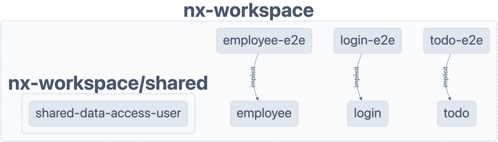

# Care In A Box

## Context

With the growth of company's products usage and variaty, comes the need to deploy features more frequently and apply changes rapidly.  

Having a single application monolith (frontend application in this case), will force the entire application to be rebuilt or at least redeployed even for small minor changes, scaling it further becomes extremely difficult.  

Further more, graduatly evolving and expanding complicated B2B products, might lead over time to duplications, repeatitive work and unneccessary dependancies, which can be significantly reduced with a decent (reusable) abstraction layer.  

### Micro-frontend

Ideally, we'd like to break the big monolithic application into smaller chunks and merged all together in some way to form one complete end user application.  

#### Advanteges  

✅ Easier maintenance  
✅ Increased acceleration.  
✅ Fast and easy scaling.  
✅ Work on different parts of the entire application in individual codebase.  
✅ Handling features independently along with independent releases.  

### Different Approaches  

Some ways to solve the monolith issues, can be summarised into two main approaches.

#### NPM  

Sharing code between applications using Node packages.

Although this approach is the most common one, there are some disadvanteges coming with it:

⚠️ Keeping up with the changes in latest versions in each of the published packages. That corresponds to increase time in updating to the changes, incompatibility resolutions, testing and deployment.

⚠️ Increases the size of application as more and more packages are added.

#### CDN

Another way to move away from the build time resolution to run time is to make each of the Micro-frontends deploy the JavaScript runtime packages to a CDN for consumption. The host application will then consume them and stitch at runtime.  

⚠️ This requires custom logic to be written and handled by the framework, and it puts lot of dependency on the framework and as and when the framework pushes updates, refactoring might be required in the application.

#### Module Federation

Module federation makes it easy to share components and information between many frontend applications and also enables to build out whole pages and create a fully federated site.

##### Advantages

✅ Independent development by teams and dynamically import code from other applications at runtime. End results feels like an SPA.    
✅ Independent testing and deployment/release strategies.  
✅ Smaller and optimised bundle size of each micro app as shared components and dependencies are loaded only when required.  
✅ Each of the micro app can choose their own tech stack and not bound by a particular framework.   

#### Import maps

[`Just docs at the moment`](https://www.angulararchitects.io/aktuelles/import-maps-the-next-evolution-step-for-micro-frontends-article/)

#### Native Fedretion

[`Just docs at the moment`](https://www.angulararchitects.io/aktuelles/announcing-native-federation-1-0/)

<hr/>

## Requirements

Although the creation a modular app with independantly deployable chunks (i.e. microfrontend, remote modules, libraries etc.) is the main goal of this task, a few predictable challanges should be considered and addressed.  

To demonstrate a good practical solution, the ideal one should follow this list:  

1. **Federated Modules** - Following the [advantages list above](https://github.com/iiddoo/care-in-a-box#Module-Federation), to demonstrate an app implementing Module Federation approach,  federated modules example should contain a shell and 2 other remote modules, plus a shared library module.  
2. **Angular** - Since the monolith already exists (written in Angular), rewriting huge and complex pieces of code, migrating or mixing other frameworks will take a very long and expensive time, basically unneccesary, because angular has a reach and well maintained [integration](https://www.angulararchitects.io/en/aktuelles/the-microfrontend-revolution-part-2-module-federation-with-angular/) with Webpack Module Federation.  
3. **SSR** - App shell and modules should be pre rendered on server side and not as SPAs, to improve perfomances and enable critical value of some SEO features and web crawlers.  
4. **Dynamic Modules Routes** - Routes values to import remote modules, should be fetched dynamically from a catalog concept (escaping the need redeploy for routes updates, or have A/B serving ability for modules.
5. **Pipeline** - A CI/CD pipeline to build and deploy the apps independtly and update the catalog.  
6. **Monorepo** - Combine all micro apps into a single repository, reducing possible versions conflicts and easying the usage of shared libraries.  

* version handling?
* why Nx

<hr/>

## Solution  

### Nx Workspace

Nx provides a reach veriaty of generators and executors, which some not natively provided by Angular CLI.  
A deeper reseach should be done further, but for the most quick solution demo - Nx can boilerplate the required structure gracefuly.  

#### Monorepo Structure

#### Angular Integration

#### Module Federation Generator

#### Shared Library Cunstructor

#### Dynamic Routing

For quick use, I've approached to have 3 apps:

* employee - the host (shell)
* Login - remote shared
* todo - remote

#### SSR Serving

Although Angular has this great ability with [Angular Universal](https://angular.io/guide/universal), the new addition to [Nx](https://nx.dev/getting-started/intro) that provides SSR out of the box just by runnig a comman - made it more apeal to use, and the clear docs on their site to [set up Angular app with SSR and Module Federation](https://nx.dev/recipes/module-federation/module-federation-with-ssr), and [how make it dynamic](https://nx.dev/recipes/module-federation/dynamic-module-federation-with-angular).

#### Manifesting Routes


<hr/>

## Steps

### Creating the Demo Workspace

Run the following command with the options listed to create an empty workspace  

``` text
npx create-nx-workspace@latest

Select:

✔ Choose your style                                 · integrated
✔ What to create inside the new workspace           · apps
✔ Repository name                                   · nx-workspace
✔ Enable distributed caching to make your CI faster · No
```

#### About the workspace

✨ **The workspace has been generated by [Nx](https://nx.dev)** ✨  

To see a diagram of the dependencies of the projects, run:

``` javascript
nx graph
```

### Installing Angular framework plugin

Using Angular framework is ruquired. See more details in the [requirements section](https://github.com/iiddoo/care-in-a-box#Requirements).

``` javascript
npm install --save-dev @nx/angular
```

### Generating the host (shell) application

Creating a host application with another 3 remote applications, forming the required [Federated Modules structure](https://github.com/iiddoo/care-in-a-box#Requirements).  

Using Nx featured generators, setting the generated applications to use the server for rendering matching the [SSR requirement](https://github.com/iiddoo/care-in-a-box#Requirements).  

``` javascript
nx g @nx/angular:host employee --ssr --dynamic
```

### Adding Login remote application  

``` javascript
nx g @nx/angular:remote login --host=employee --ssr
```

### Adding User Data Library

The user data-access library shared between the host application (dashboard) and the remote applications.  
It's being used to determine if there is an authenticated user as well as providing logic for authenticating the user.  

This library demonstrate the usage of a shared resource withing the federated modules environment, centrelizing the logic to be consumed by other applications.  

``` javascript
nx g @nx/angular:lib shared/data-access-user 
```

### Adding a User Service for foctionality

Creating an Angular Service that will be used to hold state.

``` javascript
nx g @nx/angular:service user --project=shared-data-access-user
```

Addding some simple logic (missing error handling etc.), and setting defaults for demo:  

``` typescript
import { Injectable } from '@angular/core';
import { BehaviorSubject } from 'rxjs';
@Injectable({
  providedIn: 'root',
})
export class UserService {
  private isUserLoggedIn = new BehaviorSubject(false);
  isUserLoggedIn$ = this.isUserLoggedIn.asObservable();
  checkCredentials(username: string, password: string) {
    if (username === 'care' && password === 'box') {
      this.isUserLoggedIn.next(true);
    }
  }
  logout() {
    this.isUserLoggedIn.next(false);
  }
}
```

>Username = "**care**"  
>Password = "**box**"  

Finaly, adding a new export to the shared/data-access-user's index.ts file:

``` typescript
export * from './lib/user.service';
```

### Adding another remote application

``` javascript
nx g @nx/angular:remote todo --host=employee --ssr 
```  

### Serving the host and remotes applications

Run

``` javascript
nx serve-ssr employee --devRemotes=login,todo
```

then open browser at [http://localhost:4200/](http://localhost:4200/)  

See also:  
  
* login: [http://localhost:4201/](http://localhost:4201/),  
* employee: [http://localhost:4202/](http://localhost:4202/),  
* todo": [http://localhost:4203/](http://localhost:4203/)  

  

App host and remote applications are up and running with SSR  

### Add Nx Angular plugin package

``` javascript
npm install -D @nx/angular
```

### Serving the host application

``` javascript
npx nx run employee:serve-ssr --port=4200 --skipRemotes=login,todo
```

## Serving login application

``` javascript
npx nx run login:serve-ssr --port=4041
```

## Serving todo application

``` javascript
npx nx run todo:serve-ssr --port=4042
```

<hr/>

## Known Issues

### Missing module type

>Error: `import.meta cannot be used outside of a module`  

When serving module federation apps in dev mode locally, there'll be an error output to the console, *import.meta cannot be used outside of a module*, and the script that is coming from is *styles.js*.  
It's a known error output, but it doesn't actually cause any breakages from as far as the testing has shown. It's because Angular compiler attaches the *styles.js* file to the index.html in a script tag with defer.
